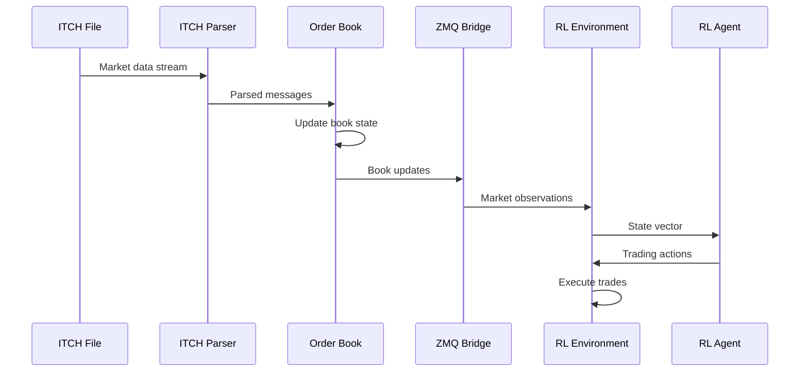

# System Architecture

## Component Overview

The HFT Order-Book Simulator consists of several interconnected components designed for maximum performance and flexibility.

## C++ Core Components

### Lock-Free Order Book (`order_book.hpp/.cpp`)

The order book is the heart of the system, implementing a high-performance, thread-safe data structure:

- **Price-time priority**: Orders are sorted by price, then by arrival time
- **Intrusive linked lists**: Minimize memory allocations
- **Boost pool allocators**: Pre-allocated memory pools for orders and price levels
- **Atomic operations**: Lock-free statistics and update queues

#### Performance Characteristics
- Add order: O(log P) where P is number of price levels
- Cancel order: O(1) with order ID lookup
- Modify order: O(1) for quantity changes
- Best bid/ask: O(1) cached values

### ITCH Parser (`itch_parser.hpp/.cpp`)

Processes NASDAQ ITCH 5.0 format market data:

- **Memory-mapped I/O**: Zero-copy file access
- **Sequential access**: Optimized for streaming data
- **Message filtering**: Symbol-based filtering for efficiency
- **Sample generation**: Built-in test data creation

#### Supported Message Types
- Add Order (A, F)
- Order Executed (E, C)
- Order Cancel (X)
- Order Delete (D)
- Order Replace (U)

### Replay Engine (`replay.cpp`)

Provides market data replay with timing controls:

- **Speed control**: 0.1x to 100x replay speeds
- **Symbol filtering**: Focus on specific instruments
- **MD5 hashing**: Deterministic book state verification
- **Statistics tracking**: Message rates and processing times

### ZMQ Bridge (`zmq_bridge.cpp`)

Real-time data streaming to Python components:

- **Push/Pull pattern**: High-throughput messaging
- **Packed structures**: Efficient serialization
- **Live mode**: Synthetic data generation for testing
- **Non-blocking sends**: Prevents order book blocking

## Python Components

### Gymnasium Environment (`env.py`)

RL-compatible trading environment:

- **50-dimensional observations**: Market state, inventory, technical indicators
- **Continuous action space**: Bid/ask offset control
- **Realistic fills**: Probability-based execution modeling
- **Transaction costs**: Spread, impact, and fixed fees

#### Observation Features
1. Best bid/ask prices and quantities
2. Order book depth metrics
3. Price history and returns
4. Technical indicators (EMA, volatility)
5. Position and PnL metrics
6. Market microstructure features

### Baseline Agent (`baseline_agent.py`)

Reference market making strategy:

- **Fixed spread**: ±2 tick base spread
- **Inventory management**: Spread widening with position
- **Risk controls**: Position limits and skewing
- **Performance tracking**: Trade analytics and PnL

### Backtester (`backtest.py`)

Comprehensive strategy evaluation:

- **Vectorized execution**: Fast historical simulation
- **Event-driven mode**: Trade-by-trade analysis
- **Transaction costs**: Almgren-Chriss model with impact
- **Risk metrics**: Sharpe, Sortino, VaR, CVaR

### PPO Training (`train_ppo.py`)

Reinforcement learning with stable-baselines3:

- **Custom callbacks**: Trading-specific metrics
- **Weights & Biases**: Experiment tracking
- **Evaluation episodes**: Out-of-sample testing
- **Model checkpointing**: Training state preservation

### Report Generator (`report.py`)

HTML tear sheet generation:

- **Performance metrics**: Returns, risk, trade analytics
- **Interactive plots**: Plotly visualizations
- **Risk analysis**: Drawdowns, distributions
- **Latency analysis**: System performance metrics

## Data Flow

## Performance Optimizations

### Memory Management
- **Pool allocators**: Reduce allocation overhead
- **Arena allocation**: Contiguous memory layout
- **Memory mapping**: Zero-copy file I/O

### CPU Optimization
- **SIMD instructions**: Vectorized calculations where possible
- **Cache-friendly access**: Sequential data structures
- **Branch prediction**: Minimize conditional jumps

### Concurrency
- **Lock-free algorithms**: Avoid thread synchronization overhead
- **Single-writer principle**: One thread updates order book
- **Message queues**: Asynchronous communication

## Scalability Considerations

### Horizontal Scaling
- **Multiple symbols**: Separate order books per instrument
- **Process isolation**: Independent C++ processes
- **Load balancing**: Distribute symbols across cores

### Vertical Scaling
- **NUMA awareness**: Pin threads to CPU cores
- **Memory bandwidth**: Minimize cross-socket access
- **Storage I/O**: NVMe SSD for market data files

## Testing Strategy

### Unit Tests
- **Order book operations**: Add, cancel, modify orders
- **Message parsing**: ITCH format validation
- **Performance tests**: Latency and throughput benchmarks

### Integration Tests
- **End-to-end**: C++ to Python data flow
- **Real-time operation**: ZMQ communication
- **Stress testing**: High-volume scenarios

### Performance Validation
- **Latency targets**: P50 < 10 μs, P99 < 100 μs
- **Throughput targets**: > 1M operations/second
- **Memory usage**: Bounded growth with order count