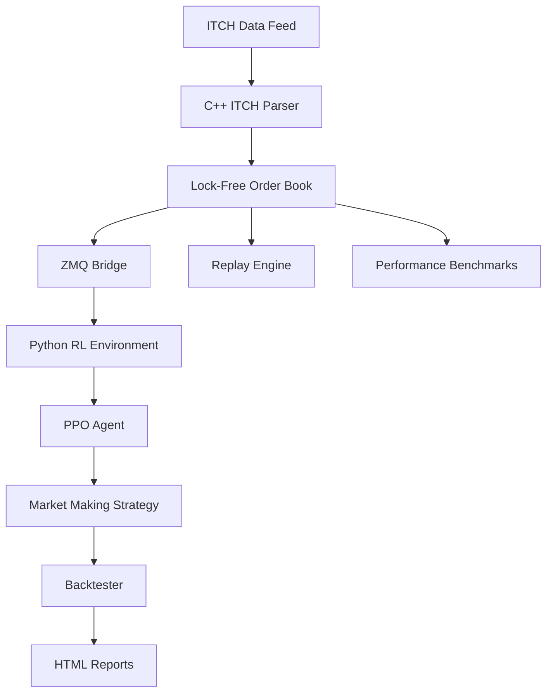

# HFT Order-Book Simulator + Market-Making RL Agent

## Overview

This project implements a high-performance order book simulator combined with reinforcement learning agents for market making strategies. The system is designed for institutional-grade high-frequency trading research and development.

## Architecture



## Key Features

### C++ Core Engine
- **Lock-free order book** with microsecond latency
- **ITCH 5.0 parser** with memory-mapped file I/O
- **Replay engine** with configurable speed controls
- **ZeroMQ bridge** for real-time data streaming

### Python RL Framework
- **Gymnasium environment** for market making
- **PPO training** with Weights & Biases integration
- **Comprehensive backtester** with transaction cost modeling
- **HTML reporting** with interactive visualizations

## Performance Targets

| Metric | Target | How to Measure |
|--------|--------|----------------|
| Order Book P50 Latency | ≤ 10 μs | Run `./build/bench_orderbook` |
| ITCH Replay Rate | ≥ 5M msgs/s | Run `./build/replay -f data.itch` |
| Test Coverage | ≥ 90% | Run `make test` |
| Sharpe Ratio | > 0.5 | Run backtests with `python/hft_rl/backtest.py` |

## Quick Start

```bash
# Clone and setup
git clone <repository> && cd HFT-OBS-MMAgent
python3 -m venv .venv && source .venv/bin/activate

# Install Python dependencies
cd python && pip install -r requirements.txt

# Build C++ components
cmake -S . -B build && cmake --build build -j

# Run benchmarks and generate report
make bench && make report
```

## Documentation Structure

- [Architecture](architecture.md) - System design and components
- [Performance](performance.md) - Benchmarks and optimization
- [API Reference](reference/) - Code documentation
- [Examples](examples/) - Usage examples and tutorials